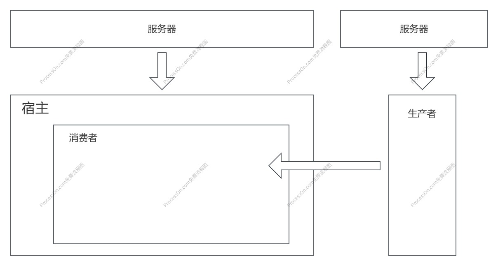

# 介绍

这个项目基于`web components`实现了一个可视化的页面编辑器，主要目的有两个，一个是现有项目快速整合到一起，另一个是将编辑器的底层逻辑与业务代码解耦，使开发人员的关注点象聚焦在业务组件的编写上。对于一些名词有疑问的参看[名称解释](./explain.md)。

## 快速整合

一般来说，当需要可视化编辑时如果项目本身没有使用`微前端`等技术，那么势必会使用当前使用的语言来开发，但是这样一来当多个项目都需要可视化编辑器，但是技术栈不同时，不可避免的需要重复开发，尤其是对于一个编辑器中的底层逻辑。

而如果是类似`宜搭`使用的低代码引擎`LowCodeEngine`虽然做了底层的抽象封装，但是对于不同的语言还是难以使用。

快速集成除了对语言没有什么硬性要求之外，在样式上也不能对原项目造成影响。基于上面的考量，`web components`显然是一个合适的选择。

## 关注点分离

这个项目通过`模块联邦`将一个可视化编辑器在物理意义上分成了两个模块，用做驱动视图渲染和组件配置的编辑器，以及由业务主导的组件和其配置。传统的可视化编辑器往往只是在目录结构上进行区分，阅读时存在一定程度上的负担，同时实际开发时往往会出于便利或者是一些个人风格在无关的地方修改代码，导致其它开发人员接手后容易踩坑。

关注点进行分离后，编辑器通过`npm包`引入，组件代码则是作为一套独立的代码去进行开发的，最大程度的限制了开发人员对代码的控制范围，从而进一步降低了开发人员接手代码后的维护难度。

## 示意图

